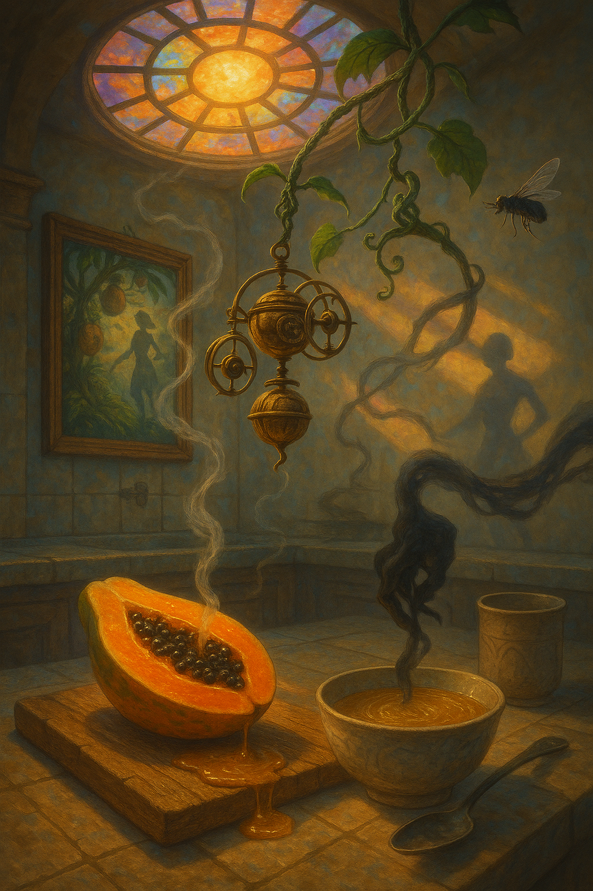
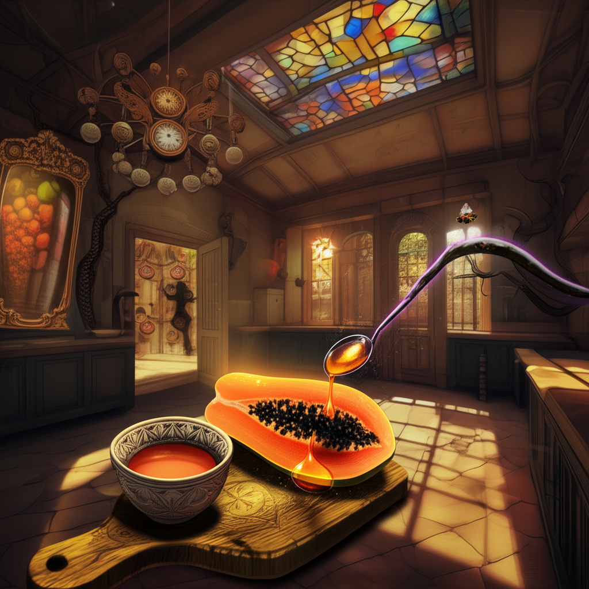
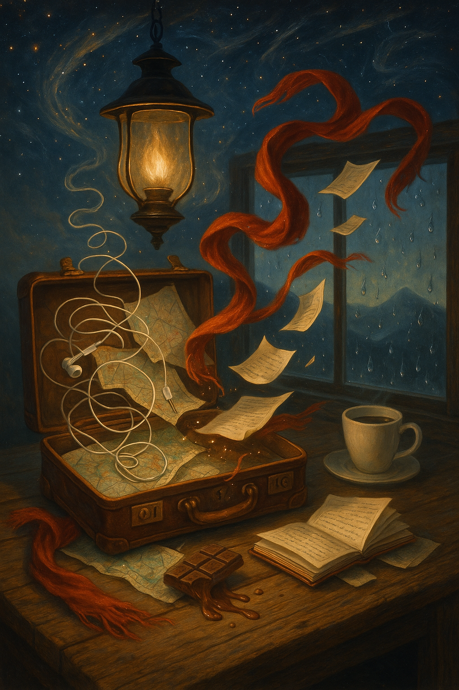
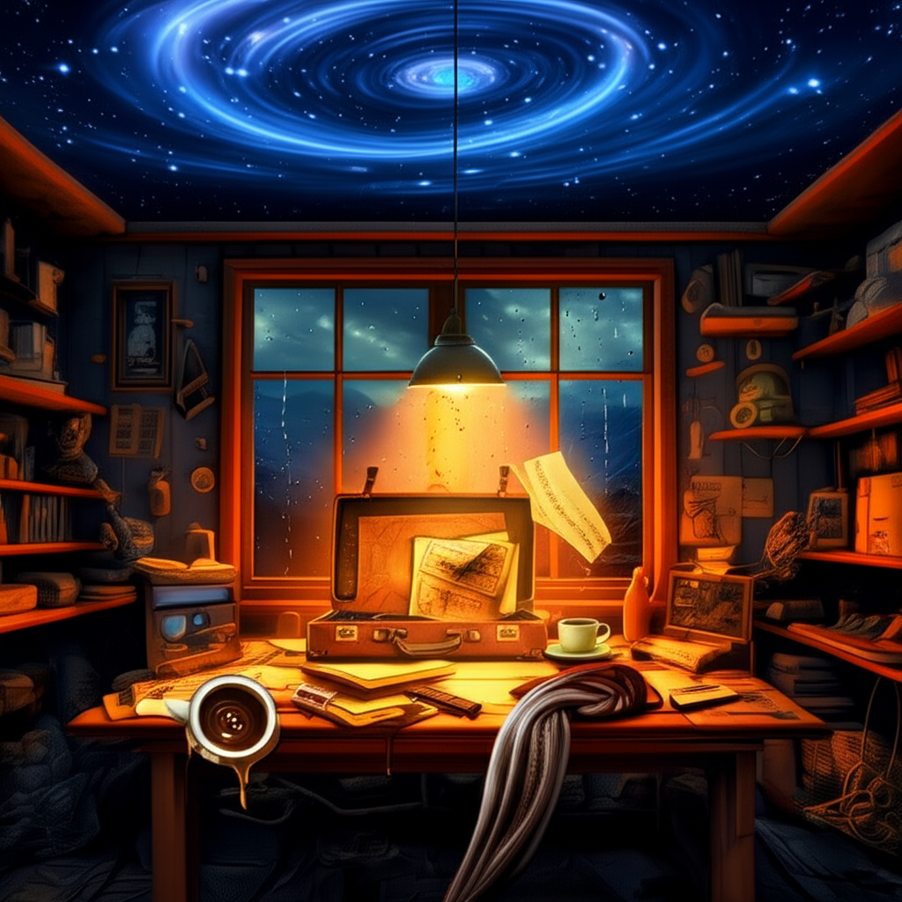

# LongBench-T2I

## 📦 Installation

```bash
git clone https://github.com/yczhou001/LongBench-T2I.git
cd LongBench-T2I
conda create -n LB python=3.10 -y
conda activate LB
pip install -r requirements.txt
```

---

## 🗂️ Project Structure

```bash
.
├── data/
│   └── instruction.jsonl       # Input instructions + labels
├── utils/                      # Utility modules for LLM/VLM interaction and evaluation
│   ├── evaluator.py            # Evaluation interface (Gemini / InternVL)
│   ├── prompt.py               # Prompt templates
│   ├── utils.py                # General helper functions
├── evaluate.py                 # Evaluation script for final outputs
├── LICENSE
└── README.md
```

---
## 🛠️ How to Run
## 📈 Evaluation: Assessing Final Image Quality
```bash
python evaluate.py \
  --method "plan4gen" \
  --eval_folder "./eval" \
  --object_file "data/instruction.jsonl" \
  --evaluator "gemini-2.0-flash" \
  --Gemni_API_Key "<your_api_key>"
```

✅ Evaluation results will be saved as a .jsonl file in the specified --eval_folder, with per-image scores, comments, and an overall statistical summary.

Example entry:
```bash
{
  "idx": ...,
  "image": ".../generated_image_....jpg",
  "objects": [
    {
      "category_name": "...",
      "description": "...",
      "score": ...,
      "evaluation": "..."
    },
    ...
  ],
  "average_score": ...
}
```

### 📊 Hyperparameters Explanation

| Hyperparameter      | Type         | Description                                                                                           | Default Value                        |
|---------------------|--------------|--------------------------------------------------------------------------------------------------------|--------------------------------------|
| `--method`          | `str`        | Name of the image generation method. Determines the subdirectory under `./outputs/` to evaluate.      | `"plan4gen_3"`                       |
| `--eval_folder`     | `str`        | Directory to save evaluation output results (`.jsonl` format).                                         | `"./eval"`                           |
| `--object_file`     | `str`        | Path to the input `.jsonl` file containing object instruction labels.                                  | `"data/instruction.jsonl"`           |
| `--evaluator`       | `str`        | Evaluation model to use. Choices: `"gemini-2.0-flash"`, `"OpenGVLab/InternVL3-78B"`.                   | `"gemini-2.0-flash"`                 |
| `--Gemni_API_Key`   | `List[str]`  | API key(s) for accessing Gemini models. Multiple keys supported for rotation.                          | **Required** (for Gemini)            |


### 🎯 Case Study Comparison
<table>
  <thead>
    <tr>
      <th style="width: 30%;"><b>Instruction</b></th>
      <th style="width: 35%;"><b>GPT-4o</b></th>
      <th style="width: 35%;"><b>Plan4gen (Ours)</b></th>
    </tr>
  </thead>
  <tbody>
    <tr>
      <td>
        <details>
          <summary>Case 0: Click to expand full instruction IDX: 176</summary>
            <p>
                "The sun hung low behind a stained-glass skylight, casting kaleidoscopic shadows across a kitchen that felt both ancient and impossible. A ripe papaya, its flesh the color of melted amber, lay cut open on a worn wooden cutting board, glistening as if drenched in a slow rain of golden honey. From its core, a single tendril of vapor curled into the air, rising not in heat but in defiance of gravity, drifting sideways into the space where the ceiling should have been. There, it met a hanging chandelier of suspended clockwork orbs, each rotating in counter-orbit to one another, their gears clicking in harmony with the drip of papaya juice into a ceramic bowl that seemed both solid and semi-transparent. Inside the bowl, liquid shimmered and thickened as it was scooped by a silver spoon, which had not been touched by a hand but by a shadowy tendril extending from a nearby wall, its form flickering like a mirage caught in a heatwave. The fly above hovered in place, its wings moving impossibly fast, casting a tiny shadow that danced across the wall and transformed, in turn, into the silhouette of a woman mid-stance in a slow, graceful pirouette. Behind her, a mirror hung askew, reflecting not the kitchen but a jungle of overripe fruit trees, each bearing fruit that pulsed and changed—mangoes into eyes, pineapples into tiny doors. A vine wrapped from the mirror to the clockwork chandelier, anchoring it with tendrils that fed on time itself, their leaves unfurling in perfect synchronization with the heartbeat of the spoon as it dipped into the papaya’s pool of nectar. A ceramic cup, empty yet full, sat nearby, its surface etched with the same pattern as the wooden cutting board, the two objects linked by an invisible thread that pulsed with a faint violet glow. A small breeze moved through the room—not from any window or fan, but from the very air as it remembered itself shifting in the absence of time. The wooden board creaked slightly, reacting to the subtle tremors caused by the spoon’s shadowy grip, while the clockwork orbs began to hum in a chord that seemed to stretch both into the future and the past. Somewhere in the periphery, a door creaked open by itself, revealing a corridor that led into a garden of fruit and gears and liquid light, each element alive with purpose and impossible symmetry. In this space, the papaya was not just fruit but a nexus, its juice a conduit for memory, its flesh a map to forgotten worlds. The kitchen, though grounded in familiar objects, was now a threshold—where logic unraveled and reality bent into the beautiful, the bewildering, and the boundless."        </details>
            </p>        
        </details>
      </td>
      <td></td>
      <td></td>
    </tr>
    <tr>
      <td>
        <details>
          <summary>Case 1: Click to expand full instruction IDX: 176</summary>
            <p>
                "In the flickering amber glow of a gas lamp that hovers midair just above the cluttered wooden kitchen table, a weathered leather suitcase remains open, its brass latches frozen in the act of being unlatched, as if time had hesitated in the moment before a journey. Inside, a tangled ball of earbuds is slowly unraveling itself, each wire twisting through a constellation of folded maps, some of which are shifting subtly as if the geography they depict is alive and restless. A half-eaten chocolate bar lies nestled among these relics of travel, its melting sides dripping not into the grain of the wood but upward, as if gravity has momentarily lost interest in this particular corner of the room. A red scarf—threaded with the faint shimmer of liquid silver—emerges from beneath a stack of notebooks, one of which is open and turning its own pages, each sheet writing new lines as it flips, ink blooming like spilled stars from an unseen pen. The coffee cup, left to cool in the corner of the table, has left a circular ring of moisture, not just on the wood but on the glass of the window, where it distorts the blurred silhouette of distant mountains. Outside, the rain does not fall but floats in suspended motion, the droplets reflecting the scene within like ghostly mirrors. The lamp casts long, wavering shadows that stretch toward the ceiling, which is not a ceiling at all but a swirling expanse of sky, where constellations blink in and out in rhythm with the turning pages. The scarf, now caught in a slow spiral of air that rises from the melting chocolate, begins to lift from the table, carrying with it a loose notebook page that floats into the lamp’s glow and is briefly consumed by its flickering flame before reappearing crumpled in the center of the suitcase. The coffee, left to sit in silence, begins to ripple without disturbance, forming patterns that mirror the tangled earbuds below it. The maps continue to shift, their borders dissolving and reforming as though they are deciding the shape of the world in real time, and with each new configuration, the mountains outside subtly change their position and hue. A faint ticking begins in the space between the scarf and the window, like the heartbeat of the room itself, and with each beat, the suitcase seems to pulse as if it is breathing, the leather contracting and expanding in a rhythm that echoes the slow, hypnotic drip of the chocolate."
            </p>        
        </details>
      </td>
      <td></td>
      <td></td>
    </tr>
  </tbody>
</table>

## 📄 License

This project is licensed under the [MIT License](https://opensource.org/licenses/MIT).
